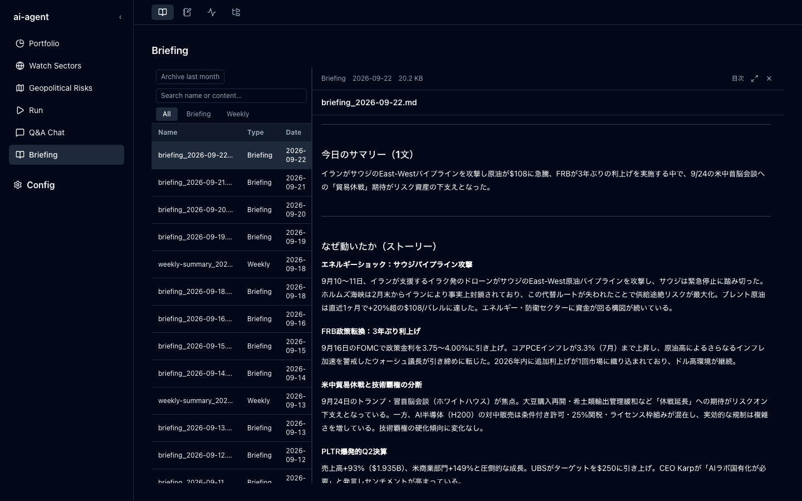
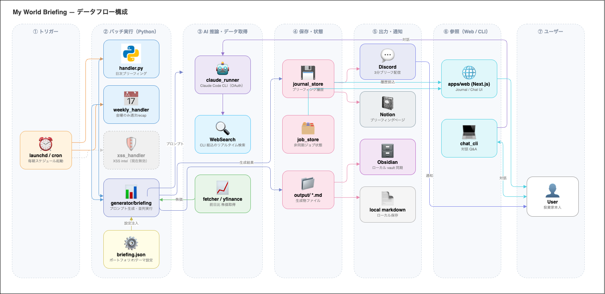
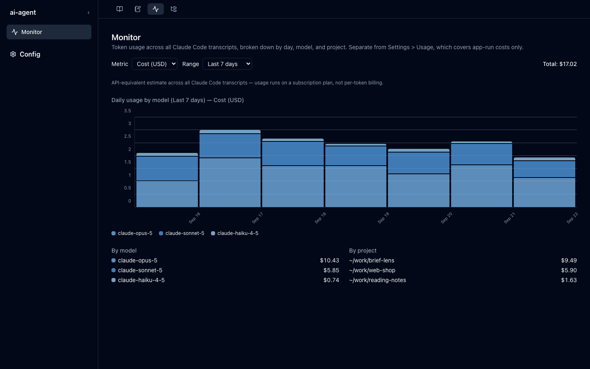

# My World Briefing — Personal Market Intelligence Agent

*English | [日本語](README.ja.md)*

An LLM agent system that collects geopolitical events, stock moves, and sector themes each morning, interprets them against a specific portfolio, and delivers a 3-minute brief to Discord and Notion. Built as a daily driver, not a demo — it has been the maintainer's own morning brief since April 2026.

| | |
|---|---|
| **Stack** | Python 3.11–3.13 · FastAPI · Next.js 14 · TypeScript · Tailwind |
| **Agent layer** | Claude Code CLI (subprocess + WebSearch), parallel prompt orchestration, opt-in local LLM mode (Ollama + Chroma) |
| **Ops** | launchd/cron scheduling, degraded-mode delivery, sleep-recovery re-run, usage & cost monitoring |

---

## Concept

> Not a tool that *outputs* information — an agent that *interprets* it through your own lens.

Bloomberg and NewsPicks surface raw data. This agent ties every event to your holdings, themes, and geopolitical risks, and generates "what this means for you" every day.

The interesting problem here is not calling an LLM — it is making a non-deterministic agent dependable enough to trust unattended every morning: partial-failure handling, recovery after a missed run, injection containment where yesterday's model output becomes today's prompt, and cost visibility. Those constraints drove most of the design below.



<sub>The Web UI's briefing viewer — searchable archive on the left, rendered brief with a generated table of contents on the right. Every entry is one unattended 05:00 run.</sub>

---

## Architecture



<sub>Source: [docs/architecture.drawio](docs/architecture.drawio) — sequence-level detail in [docs/sequence-diagrams.md](docs/sequence-diagrams.md)</sub>

```bash
bin/*.sh → apps/python/bin/*.sh          # thin wrappers that exec into the Python app

apps/python/
  src/handler.py                  # Daily market briefing (bin/run.sh)
  │     ├── fetcher/stocks.py     # Previous-day % change via yfinance
  │     ├── generator/briefing.py # Builds prompts, calls run_claude() in parallel
  │     ├── notifier/local_md.py  # Writes output/briefing_YYYY-MM-DD.md first
  │     ├── notifier/discord.py
  │     └── notifier/notion.py
  src/weekly_handler.py           # Fridays only: weekly recap + Notion comment ingestion
  src/self_agent_handler.py       # Judgment log → persona profile → Notion (bin/self_agent.sh)
  src/xss_handler.py              # XSS intel agent — currently disabled in run.sh
  src/claude_runner.py            # Shared claude CLI helper (subprocess + WebSearch)
  web/                            # FastAPI backend for the Web UI (localhost + bearer token)
  config/briefing.json            # Portfolio, watch sectors, geopolitical risks

apps/web/                         # Next.js UI — briefing viewer, chat, journal, usage monitor
```

**Key design decisions**

- No NewsAPI — Claude Code CLI's built-in WebSearch handles real-time search
- No per-token Anthropic API billing — runs on the Claude Code CLI OAuth session, which requires an active paid Claude subscription (Pro/Max); the free plan cannot run this
- Geopolitical → stock causality is baked into every daily output
- Single choke point for LLM calls — every `claude` invocation goes through `src/claude_runner.py`, so auth mode, env handling, and retries have exactly one implementation

**Running an agent unattended**

The system assumes the LLM step can fail, hang, or return something unusable, and that nobody is watching at 05:00:

| Concern | Where it is handled |
|---|---|
| Partial failure — sector sweep dies, briefing must still ship | Degraded mode in `src/handler.py`; `notifier/local_md.py` writes to disk *before* any network delivery |
| Missed run (machine asleep through the schedule) | `bin/recover.sh` → `src/recovery_handler.py`, a no-op when today's briefing is already complete |
| Prompt injection | `src/prompt_safety.py` — `neutralize_user_text` defuses role markers in config-supplied strings; `wrap_untrusted` fences reused LLM output (yesterday's briefing fed into today's chat) as data, not instructions |
| Transient API/network errors | `src/transient_errors.py`, retried inside `claude_runner` |
| Cost drift | `src/usage_logger.py` / `usage_monitor.py` / `claude_rates.py`, surfaced in the Web UI's Monitor tab |

<details>
<summary><b>Precondition — no scheduler can fix a sleeping Mac.</b> Unattended runs need the lid open and AC power; here is what happens when they don't have it.</summary>

<br>

Everything above assumes the machine is genuinely awake at the scheduled time: **lid open, on AC power** (`pmset -g custom` reports `sleep 0` on AC). Closing the lid sleeps the machine regardless of power source.

On a lid-closed, battery-powered Mac the 05:00 job fires inside a ~45-second DarkWake. The claude CLI's connection dies with `API Error: Connection closed mid-response`, and the transient retries then burn subscription tokens **without producing a briefing at all** — measured at over \$2 on 2026-08-12 ([#443](https://github.com/KazusaNakagawa/ai-agent-cli/issues/443)). `caffeinate -ims` does not rescue this: `man caffeinate` restricts `-s` to AC power, so it cannot hold a battery-powered DarkWake open long enough for the calls to finish.

This is why **manual execution is the maintainer's current schedule** rather than launchd or cron. Details and measurements: [launchd-setup.md](docs/guides/launchd-setup.md), [cron-setup.md](docs/guides/cron-setup.md).

</details>



<sub>Monitor tab — API-equivalent cost per day, broken down by model and project. Models with no published rate are excluded from the total rather than silently priced at zero.</sub>

---

## Setup

**Prerequisites:** Python 3.11–3.13 (every version runs in CI), [uv](https://github.com/astral-sh/uv), [Claude Code CLI](https://claude.ai/code) authenticated, Discord Bot, Notion integration.

```bash
git clone https://github.com/KazusaNakagawa/ai-agent-cli.git
cd ai-agent-cli
cp .env.example .env      # add DISCORD_TOKEN, NOTION_API_KEY, etc.

cd apps/python
uv venv .venv
uv pip sync requirements.txt

cd ../web && npm install  # only needed for the Web UI
```

See [docs/guides/configuration.md](docs/guides/configuration.md) for all environment variables and config schema.

## Run

```bash
bin/run.sh             # daily briefing (+ weekly recap on Fridays)

# Interactive Q&A on today's briefing
bin/chat.sh            # new or resumed session
bin/chat.sh 2026-05-16 # specific past briefing
bin/chat.sh --list     # list saved sessions

# Portfolio snapshot — weights, FX exposure and allocation-rule checks
bin/portfolio.sh            # writes apps/python/output/portfolio/snapshot_<date>.md
bin/portfolio.sh --stdout   # print instead of writing

# Web UI — FastAPI (:8000) + Next.js (:3000), opens the browser
bin/serve.sh
bin/serve.sh --no-browser

# Dry-run (validate credentials without executing)
cd apps/python
.venv/bin/python -m src.handler --dry-run
.venv/bin/python -m src.xss_handler --dry-run
```

### Batch scripts (`bin/`)

Thin wrappers that `exec` into `apps/python/bin/`. Each targets a specific task:

| Script | Purpose |
|---|---|
| `run.sh` | Run the daily briefing (+ weekly recap on Fri) — **manual execution is the active schedule** on the maintainer machine; see [launchd-setup.md](docs/guides/launchd-setup.md#manual-execution-active). See [Architecture](#architecture) for the disabled XSS intel agent |
| `chat.sh` | Interactive Q&A on a briefing session |
| `serve.sh` | Launch the full Web UI — FastAPI + Next.js; `API_PORT` / `WEB_PORT` overridable |
| `self_agent.sh` | Turn judgment-log entries into a persona profile and post it to Notion |
| `briefing_api.sh` | Generate a briefing via the API entry point |
| `chart.sh` | Generate charts (e.g. stock price comparison) |
| `portfolio.sh` | Render a portfolio snapshot (weights, look-through FX exposure, allocation-rule checks) from `config/holdings.json` |
| `gen_wordset.sh` | Generate word-set JSON (Stage 1) |
| `evaluate.sh` | Run the briefing evaluation pipeline |
| `eval_report.sh` | Extract → score → report evaluation results |
| `local_llm.sh` | Local LLM mode (Ollama + Chroma) |
| `archive.sh` | Archive a month's briefings to Google Drive via rclone |
| `recover.sh` | Re-run today's sector sweep if the 05:00 briefing lost it to a DarkWake sleep — no-op when today's briefing is already complete |

---

## Tests

```bash
cd apps/python && .venv/bin/pytest -v   # 1,053 cases / 72 files
cd apps/web && npm test                 # vitest (unit + component)
cd apps/web && npm run test:e2e         # Playwright
```

Both suites run on push via GitHub Actions ([`pytest.yml`](.github/workflows/pytest.yml), [`web.yml`](.github/workflows/web.yml)). Tests load `apps/python/tests/config/briefing.json` — `conftest.py` pins `BRIEFING_CONFIG_PATH` before any `src.config` import, so no personal config is ever needed to run them.

---

## Docs

| Topic | Link |
|---|---|
| Configuration (env vars, config schema, prompts) | [docs/guides/configuration.md](docs/guides/configuration.md) |
| Daily briefing (manual `./bin/run.sh`; optional launchd) | [docs/guides/launchd-setup.md](docs/guides/launchd-setup.md) |
| Scheduled execution (cron + pmset, alternative) | [docs/guides/cron-setup.md](docs/guides/cron-setup.md) |
| Briefing archive (monthly zip → Google Drive via rclone) | [docs/guides/briefing-archive.md](docs/guides/briefing-archive.md) |
| Testing & dependency management | [docs/guides/testing.md](docs/guides/testing.md) |
| Web UI setup | [docs/guides/web-ui-setup.md](docs/guides/web-ui-setup.md) |
| Usage monitoring (Monitor tab, Settings > Usage, cost estimates) | [docs/guides/usage-monitoring.md](docs/guides/usage-monitoring.md) |
| Briefing evaluation pipeline | [docs/features/evaluation.md](docs/features/evaluation.md) |
| Journal ↔ Notion sync | [docs/features/journal-notion-sync.md](docs/features/journal-notion-sync.md) |
| Notion comment → judgment-log ingestion | [docs/features/notion-comment-judgment-ingestion.md](docs/features/notion-comment-judgment-ingestion.md) |
| Local LLM mode (Ollama + Chroma) | [docs/features/local-llm.md](docs/features/local-llm.md) |
| Sequence diagrams (core flows) | [docs/sequence-diagrams.md](docs/sequence-diagrams.md) |
| XSS intel agent (idea, not yet active) | [docs/ideas/xss-vulnerability-detection-agent.md](docs/ideas/xss-vulnerability-detection-agent.md) |
| Reports & audits | [docs/reports/](docs/reports/) |

---

## License

MIT
