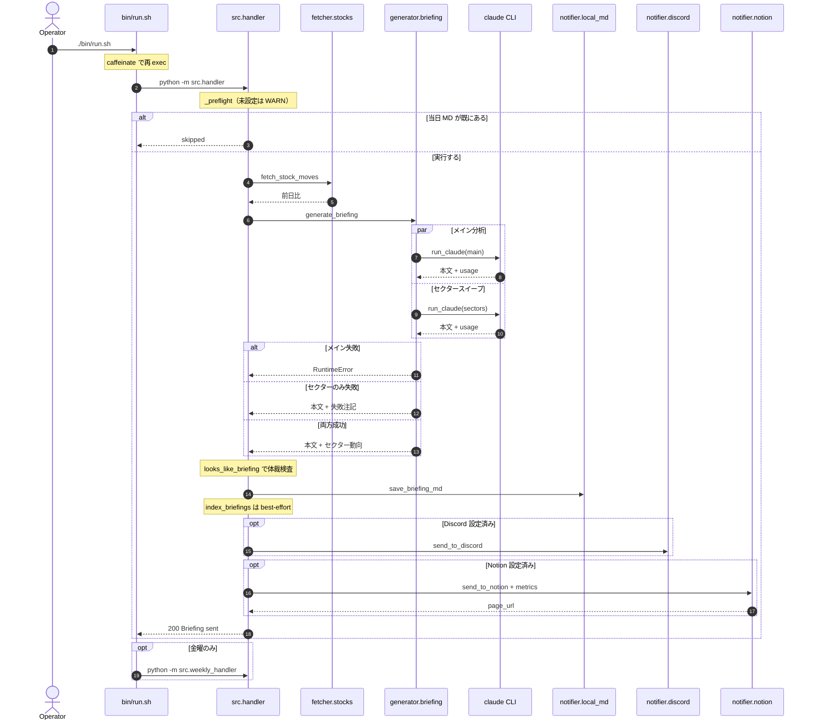
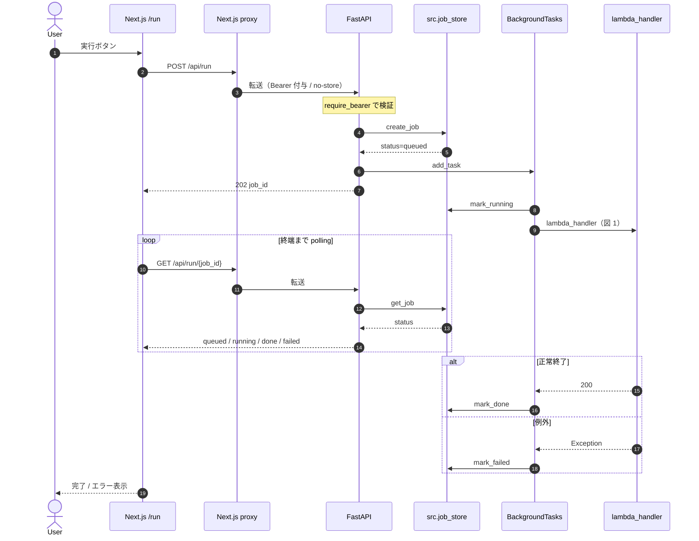
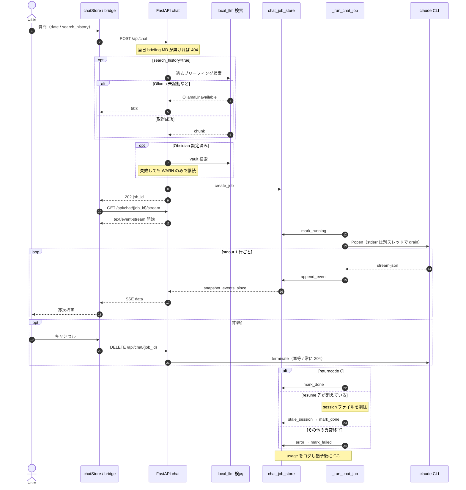
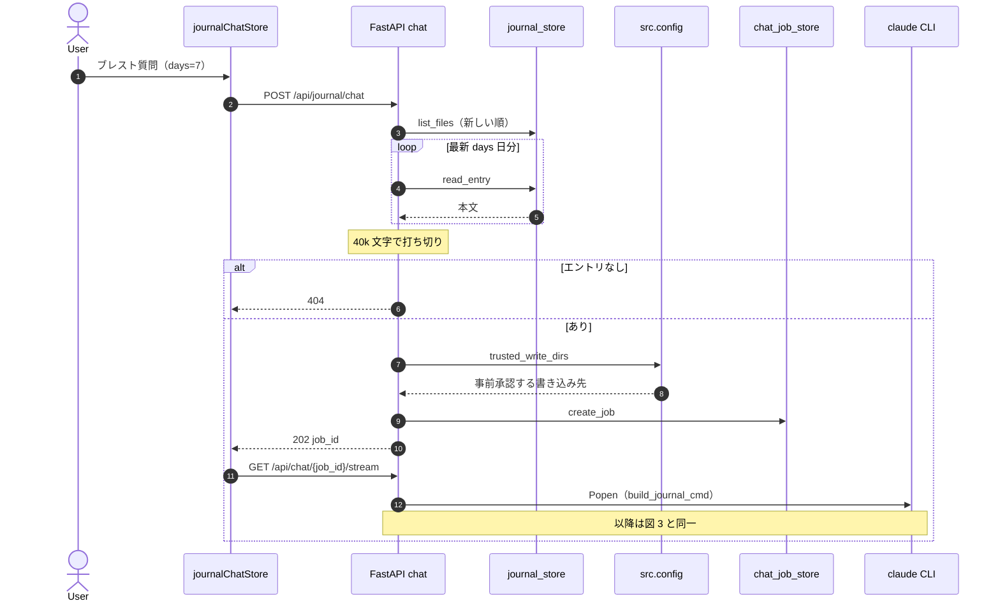
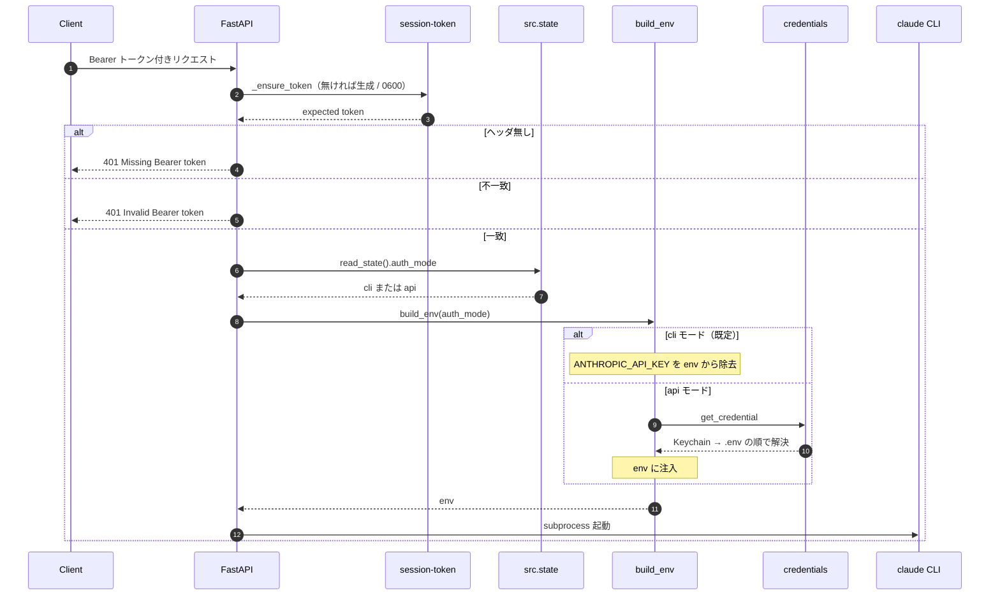
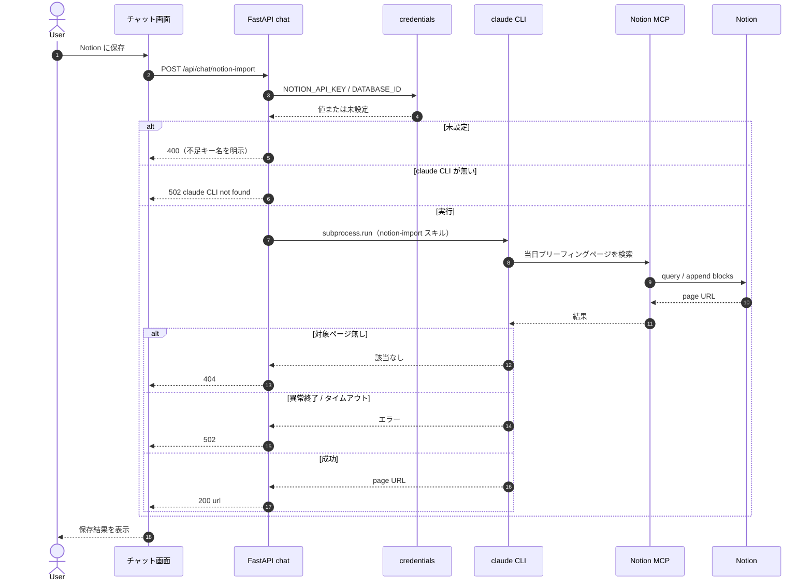

# Sequence Diagrams

主要フローの処理シーケンス（Mermaid）。コードを読む前の見取り図として使う。

- [1. 日次ブリーフィング（バッチ実行）](#1-日次ブリーフィングバッチ実行)
- [2. Web UI からのブリーフィング実行](#2-web-ui-からのブリーフィング実行)
- [3. ブリーフィング QA チャット（SSE）](#3-ブリーフィング-qa-チャットsse)
- [4. Journal ブレストチャット](#4-journal-ブレストチャット)
- [5. 認証とクレデンシャル解決](#5-認証とクレデンシャル解決)
- [6. チャット回答の Notion 追記](#6-チャット回答の-notion-追記)

---

## 1. 日次ブリーフィング（バッチ実行）

`bin/run.sh` → `python -m src.handler` の一本道。claude CLI 2 本を並列実行し、
メイン分析が落ちたときだけ全体を失敗させる（セクタースイープは劣化継続）。

エントリポイント: `apps/python/src/handler.py:29` (`lambda_handler`)

---

## 2. Web UI からのブリーフィング実行

POST は 202 を即返し、実処理は FastAPI の `BackgroundTasks` に載る。
フロントは `GET /api/run/{job_id}` を終端ステータスまでポーリングする。

エントリポイント: `apps/python/web/routers/run.py:55`

---

## 3. ブリーフィング QA チャット（SSE）

POST でジョブを作って 202 を返し、別コネクションの SSE で本文を流す 2 段構え。
SSE はバッファ全量を replay してから tail するので、途中で再アタッチしても取りこぼさない。

エントリポイント: `apps/python/web/routers/chat.py:345`（POST）/ `:485`（stream）/ `:499`（cancel）

---

## 4. Journal ブレストチャット

図 3 のジョブ / SSE 機構をそのまま再利用し、入力コンテキストの作り方だけが異なる。
直近 N 日分の journal エントリを untrusted input として system prompt に載せる。

エントリポイント: `apps/python/web/routers/chat.py:452`

---

## 5. 認証とクレデンシャル解決

API 側の Bearer と、claude サブプロセスに渡す env（`auth_mode` 依存）は別物。
`ANTHROPIC_API_KEY` を触るのは `build_env()` だけ、という不変条件を図示する。

エントリポイント: `apps/python/web/auth.py:35` / `apps/python/src/claude_runner.py:119`

---

## 6. チャット回答の Notion 追記

Notion への追記ロジックは API 側ではなくローカルの `/notion-import` スキルが持つ。
エンドポイントは claude CLI サブプロセスの起動とステータス変換だけを担当する。

エントリポイント: `apps/python/web/routers/chat.py:601`

---

## 補足

- ジョブストア（`src.job_store` / `src.chat_job_store`）はいずれもプロセス内メモリ。uvicorn を再起動すると実行中ジョブは消える。
- フロント側は画面遷移をまたいで生存させるため store + jobStore + 常駐 bridge の構成を取る（`lib/chatStore.tsx`, `lib/chatJobStore.tsx`, `lib/journalChatJobStore.tsx`）。
- claude CLI 呼び出しは必ず `src/claude_runner.py` 経由か、chat router の `build_env()` 経由。直接 `subprocess.run(["claude", ...])` を書かない（CLAUDE.md の規約）。
